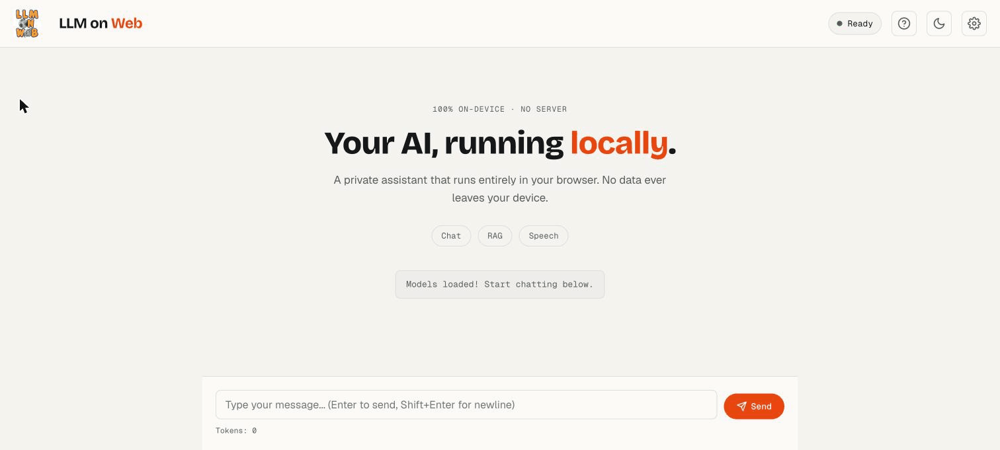
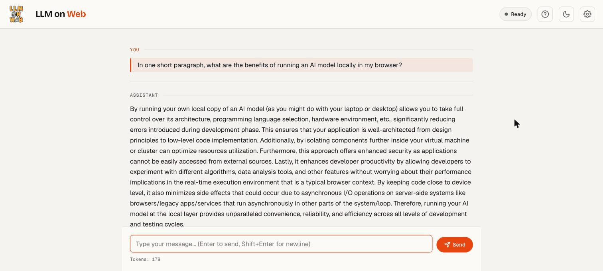
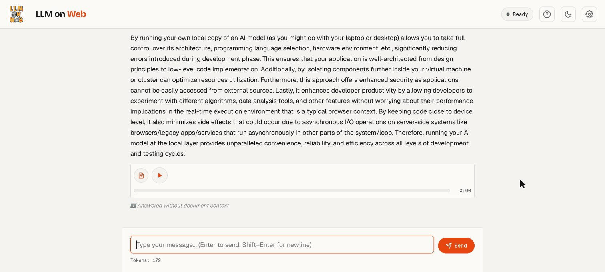
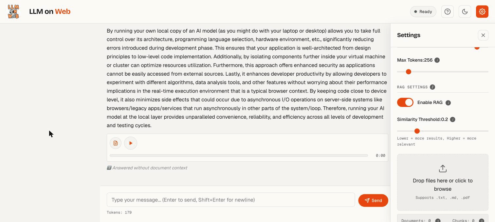
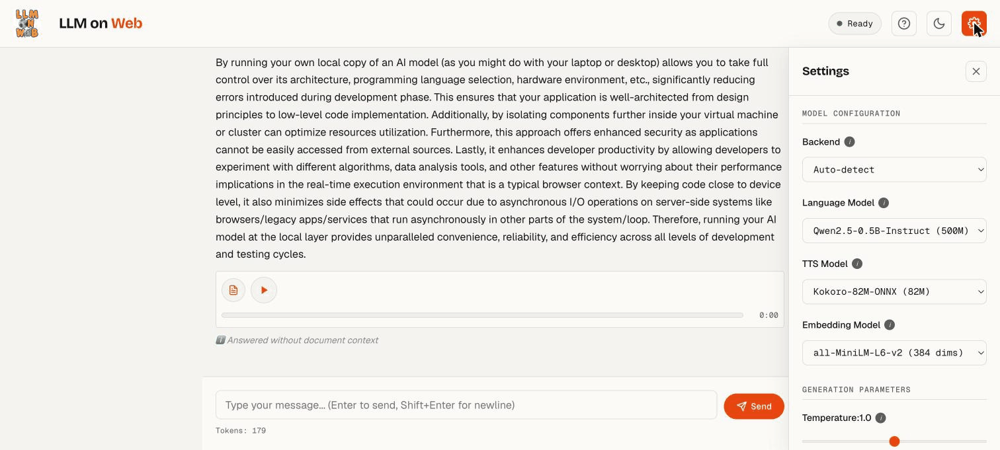
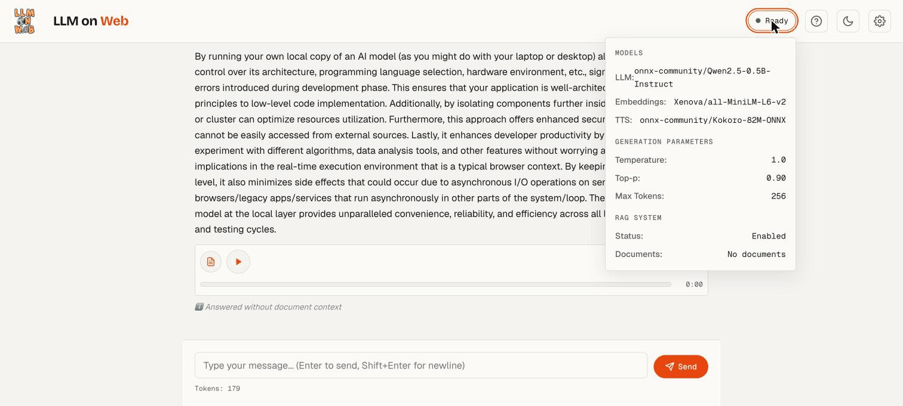
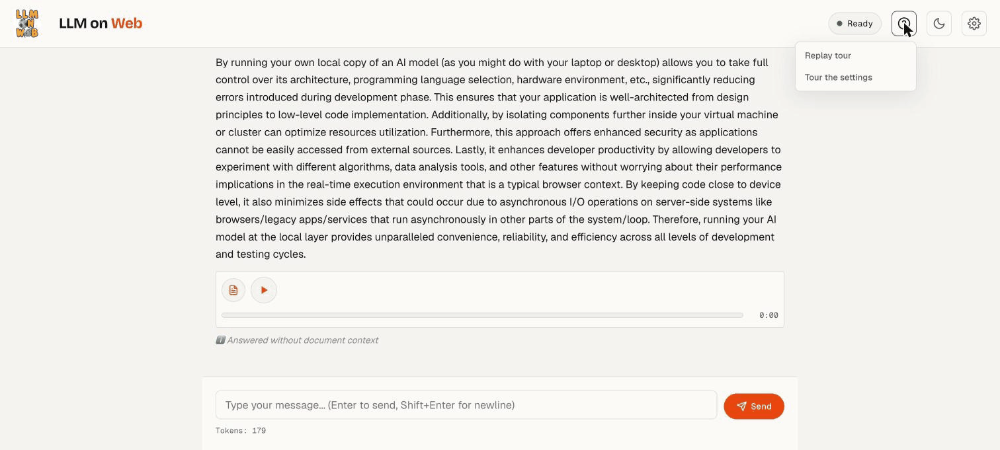
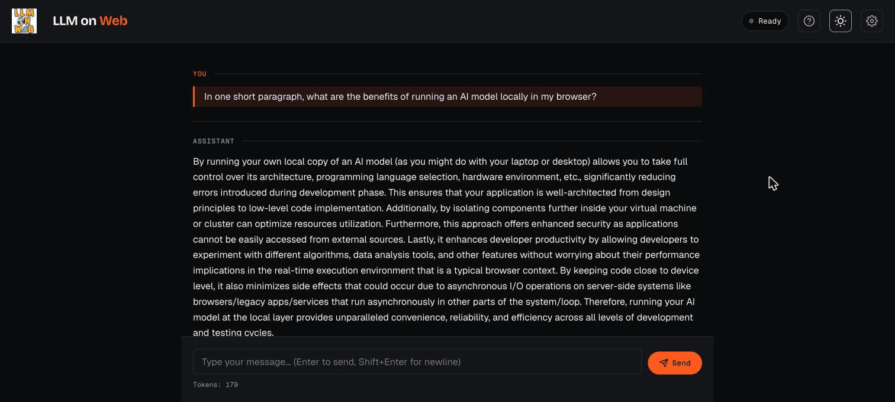

  
  <h1>LLM on Web — User Guide</h1>
  
<em>A complete walkthrough of running a private AI assistant entirely in your browser.</em>

---

## Table of Contents

1. [What is LLM on Web?](#1-what-is-llm-on-web)
2. [First Launch](#2-first-launch)
3. [Chatting with the Assistant](#3-chatting-with-the-assistant)
4. [Text-to-Speech & Downloads](#4-text-to-speech--downloads)
5. [Using RAG (Document Q&A)](#5-using-rag-document-qa)
6. [Settings Reference](#6-settings-reference)
7. [System Status](#7-system-status)
8. [Help Menu & Guided Tour](#8-help-menu--guided-tour)
9. [Light & Dark Themes](#9-light--dark-themes)
10. [Installing as an App (PWA)](#10-installing-as-an-app-pwa)
11. [Troubleshooting](#11-troubleshooting)

---

## 1. What is LLM on Web?

LLM on Web is a Progressive Web App that runs AI language models **100% in your browser** — no server, no account, no data ever leaving your device. It can:

- **Chat** with a local language model (Qwen2.5-0.5B-Instruct)
- **Answer questions about your documents** using RAG (Retrieval Augmented Generation)
- **Read responses aloud** with high-quality text-to-speech (Kokoro-82M)

All processing happens on your machine using **WebGPU** (with an automatic **WASM** fallback). Once the models are cached, the app works **offline**.

---

## 2. First Launch

When you open the app, it downloads and caches the AI models. This happens once and may take a few minutes on the first run (roughly 200–500 MB for the language/embedding models, plus ~330 MB for text-to-speech).

When the status pill in the top-right reads **Ready** and you see *“Models loaded! Start chatting below.”*, you're good to go.

The landing screen highlights the three core capabilities — **Chat**, **RAG**, and **Speech** — and shows the message box at the bottom.

> **Tip:** The first load needs an internet connection to fetch the models from Hugging Face. After that, everything runs locally and offline.

---

## 3. Chatting with the Assistant

1. Click the message box at the bottom of the screen.
2. Type your question.
3. Press **Enter** to send (use **Shift+Enter** for a new line), or click **Send**.

Responses **stream in token by token**. While the model is generating, the **Send** button becomes a **Stop** button so you can cut a response short at any time. A live **token counter** and **timer** appear below the input.

Each turn is labelled **YOU** and **ASSISTANT** so the conversation is easy to follow. Your chat history is saved locally in the browser, so it's still there when you come back.

---

## 4. Text-to-Speech & Downloads

Every assistant message has a small toolbar beneath it:

| Control | What it does |
| --- | --- |
| ▶ **Play** | Generates speech and plays the message aloud. Click again to **pause/resume**. |
| 📄 **Download message** | Saves the message text as a Markdown (`.md`) file. |
| **Progress bar / timer** | Shows playback position once audio is generated. |

**How speech generation works**

- Short messages are generated in one pass.
- Longer messages (roughly 400+ characters) use **streaming** — audio starts playing almost immediately while the rest is still being produced. A *(streaming…)* indicator shows during generation.
- Markdown formatting is automatically stripped before speaking, so you hear clean text.
- After audio is generated, an **audio download** icon lets you save it as a `.wav` file.

The small badge under a message (e.g. *“Answered without document context”*) tells you whether RAG was used for that answer — see the next section.

---

## 5. Using RAG (Document Q&A)

RAG lets the assistant answer questions using **your own documents** instead of relying only on what the model already knows. The app embeds your files, stores them locally, and retrieves the most relevant passages to ground each answer.

Open **Settings** (gear icon, top-right) and scroll to the **RAG Settings** section:

**Step by step**

1. **Enable RAG** — toggle it on (it's on by default).
2. **Add documents** — drag files onto the *“Drop files here or click to browse”* zone, or click it to pick files.
3. **Ask a question** — the assistant searches your documents and uses the matching passages as context.

**Supported files**

- The file picker accepts **`.txt`**, **`.md`**, and **`.pdf`**.
- Dragging in other plain-text and code formats also works — the processor handles `.json`, `.html`, `.css`, and code files such as `.js` as well.

**Similarity Threshold**

The slider controls how closely a passage must match your question to be included:

- **Lower (≈0.1–0.3):** more passages included — broader, more forgiving recall.
- **Higher (≈0.4–0.6):** only very relevant passages — tighter, more precise context.

**Managing documents**

Further down the RAG section you'll find document counts (Documents / Chunks), a **Document Management** list, a **Refresh** button, and **Clear All** to remove every stored document at once.

**Good questions to try after uploading**

- *“What does this document say about X?”*
- *“Summarise the main points.”*
- *“Explain the code in this file.”*

> When RAG finds relevant context, the answer is grounded in your files. When it doesn't (or RAG is off), you'll see the *“Answered without document context”* badge.

---

## 6. Settings Reference

Click the **gear icon** in the top-right to open the Settings panel.

### Model Configuration

| Setting | Description |
| --- | --- |
| **Backend** | `Auto-detect` (recommended), `WebGPU`, or `WASM`. WebGPU uses your GPU for speed; WASM works everywhere as a fallback. |
| **Language Model** | The model that generates responses — Qwen2.5-0.5B-Instruct. |
| **TTS Model** | The text-to-speech model — Kokoro-82M. |
| **Embedding Model** | Creates vector representations of your documents for RAG search — all-MiniLM-L6-v2 (384 dimensions). |

### Generation Parameters

| Setting | Range | Effect |
| --- | --- | --- |
| **Temperature** | 0.0–2.0 | Lower = focused and deterministic; higher = more creative and varied. |
| **Top-p** | 0.0–1.0 | Nucleus sampling. Lower values keep output focused; higher values allow more variety. |
| **Max Tokens** | 50–2048 | Maximum response length. One token ≈ 0.75 words. Higher = longer answers but slower. |

Each setting has a small **ⓘ** info icon — hover or focus it for an inline explanation.

### Actions

Near the bottom of the panel you'll find quick actions like **Clear Chat** and **Export Chat**.

---

## 7. System Status

Click the **status pill** (the “Ready” chip in the top-right) to expand a details popover:

It shows the active **Models**, current **Generation Parameters** (Temperature, Top-p, Max Tokens), and the **RAG System** state (enabled/disabled and document count) — handy for confirming what's loaded at a glance.

---

## 8. Help Menu & Guided Tour

First-time visitors get an **onboarding tour** with interactive coachmarks that point out each part of the interface. You can revisit it any time from the **Help menu** (the **?** icon, top-right):

- **Replay tour** — restart the full first-run walkthrough.
- **Tour the settings** — a focused deep-dive into the Settings panel.

---

## 9. Light & Dark Themes

Use the **sun/moon icon** in the top-right to switch between light and dark themes. Your choice is remembered, and the app respects your operating system's preference by default.

---

## 10. Installing as an App (PWA)

LLM on Web can be installed like a native app:

1. Open it in Chrome, Edge, or Safari.
2. Click the **install** icon in the address bar, or
3. Use the browser menu → **“Install LLM on Web.”**

Once installed, it launches in its own window and works offline (after the models have been cached).

---

## 11. Troubleshooting

**Models won't load**
- Make sure you have an internet connection for the initial download.
- Confirm your browser supports WebGPU or WASM (Chrome/Edge 90+, Safari 16.4+, Firefox 110+).
- Clear the browser cache and reload.
- Check the browser console for specific errors.

**Slow responses**
- WebGPU is 2–5× faster than WASM — make sure the **Backend** isn't forced to WASM.
- Close other heavy tabs to free up memory.
- Lower **Max Tokens** for quicker replies.

**PDF text didn't extract well**
- Complex or scanned PDFs may extract poorly. Try copying the text manually and uploading it as a `.txt` file.

**Audio won't play**
- The TTS model downloads separately on first use — give it a moment, then try **Play** again.

---

  LLM on Web runs entirely on your device. No analytics, no tracking, no server calls — except the one-time model download.

